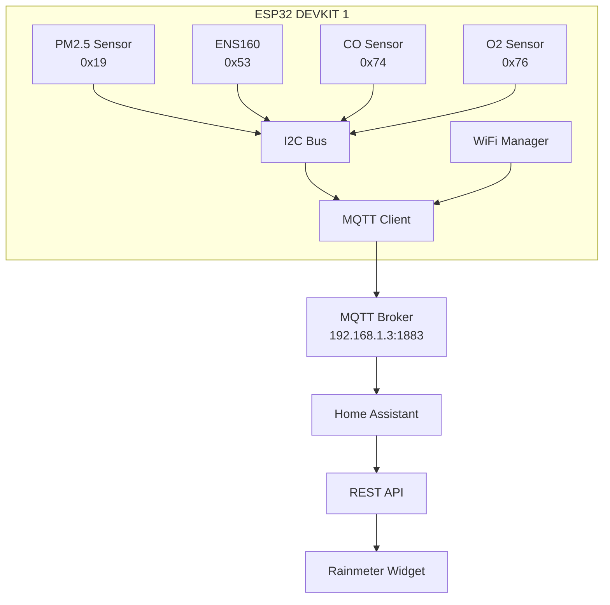

# ESP32 Air Quality Monitor - System Architecture

## Project Overview

Multi-sensor air quality monitoring system using ESP32 that publishes sensor data to Home Assistant via MQTT, with a Rainmeter desktop widget for real-time display.

## Hardware Components

### ESP32 DEVKIT 1
- Main microcontroller
- WiFi connectivity
- I2C master for sensor communication

### Sensors (All I2C)

| Sensor | Model | I2C Address | Measurements | Library |
|--------|-------|-------------|--------------|---------|
| PM2.5 Sensor | DFRobot SEN0460 | 0x19 | PM1.0, PM2.5, PM10 | DFRobot_AirQualitySensor |
| Multi-Gas Sensor | DFRobot ENS160 | 0x53 | TVOC, eCO2, AQI, Status | DFRobot_ENS160 |
| CO Gas Sensor | DFRobot SEN0465 | 0x74 | CO concentration (ppm) | DFRobot_MultiGasSensor |
| O2 Gas Sensor | DFRobot SEN0476 | 0x76 | O2 percentage | DFRobot_MultiGasSensor |

## Network Configuration

### WiFi Settings
- SSID: WiFi
- Static IP: 192.168.1.25
- Gateway: 192.168.1.1
- Subnet: 255.255.255.0
- DNS: 8.8.8.8

### MQTT Broker
- Broker IP: 192.168.1.3
- Port: 1883
- Username: richowen
- Client ID: esp32_air_quality_sensor

## System Architecture



## Data Flow

### 1. Sensor Reading Loop (30-second intervals)
1. Read PM2.5 sensor → PM1.0, PM2.5, PM10 values
2. Read ENS160 sensor → TVOC, eCO2, AQI, Status
3. Read CO sensor → CO concentration
4. Read O2 sensor → O2 percentage
5. Log all readings to Serial
6. Publish all data via MQTT

### 2. MQTT Publishing
- Each sensor publishes to separate topics
- Uses retained messages for last known values
- Auto-discovery configurations sent on startup

### 3. Home Assistant Integration
- Auto-discovers sensors via MQTT
- Stores historical data
- Exposes REST API endpoints

### 4. Rainmeter Display
- Polls Home Assistant REST API
- Updates desktop widget with current values
- Visual indicators for air quality levels

## MQTT Topic Structure

### Base Topic: `homeassistant/sensor/esp32_air_quality/`

### Auto-Discovery Topics
```
homeassistant/sensor/esp32_air_quality_pm1/config
homeassistant/sensor/esp32_air_quality_pm25/config
homeassistant/sensor/esp32_air_quality_pm10/config
homeassistant/sensor/esp32_air_quality_tvoc/config
homeassistant/sensor/esp32_air_quality_eco2/config
homeassistant/sensor/esp32_air_quality_aqi/config
homeassistant/sensor/esp32_air_quality_co/config
homeassistant/sensor/esp32_air_quality_o2/config
```

### State Topics
```
homeassistant/sensor/esp32_air_quality_pm1/state
homeassistant/sensor/esp32_air_quality_pm25/state
homeassistant/sensor/esp32_air_quality_pm10/state
homeassistant/sensor/esp32_air_quality_tvoc/state
homeassistant/sensor/esp32_air_quality_eco2/state
homeassistant/sensor/esp32_air_quality_aqi/state
homeassistant/sensor/esp32_air_quality_co/state
homeassistant/sensor/esp32_air_quality_o2/state
```

## Sensor Data Specifications

### PM2.5 Sensor (SEN0460)
- **PM1.0**: Particulate Matter 1.0 μm (μg/m³)
- **PM2.5**: Particulate Matter 2.5 μm (μg/m³)
- **PM10**: Particulate Matter 10 μm (μg/m³)
- **Unit of Measurement**: μg/m³
- **Device Class**: pm25, pm10

### ENS160 Multi-Gas Sensor
- **TVOC**: Total Volatile Organic Compounds (ppb)
- **eCO2**: Equivalent CO2 (ppm)
- **AQI**: Air Quality Index (1-5 scale)
- **Status**: Sensor operational status
- **Device Class**: volatile_organic_compounds, carbon_dioxide, aqi

### CO Gas Sensor (SEN0465)
- **CO**: Carbon Monoxide concentration (ppm)
- **Range**: 0-1000 ppm
- **Device Class**: carbon_monoxide

### O2 Gas Sensor (SEN0476)
- **O2**: Oxygen percentage (%)
- **Range**: 0-25%
- **Normal**: ~20.9%

## Home Assistant Auto-Discovery Payload Example

```json
{
  "name": "Air Quality PM2.5",
  "unique_id": "esp32_aq_pm25",
  "state_topic": "homeassistant/sensor/esp32_air_quality_pm25/state",
  "unit_of_measurement": "μg/m³",
  "device_class": "pm25",
  "value_template": "{{ value }}",
  "device": {
    "identifiers": ["esp32_air_quality_sensor"],
    "name": "ESP32 Air Quality Monitor",
    "manufacturer": "DFRobot",
    "model": "Multi-Sensor Array"
  }
}
```

## Error Handling Strategy

### WiFi Connection
- Attempt connection with static IP configuration
- Retry every 5 seconds on failure
- Log connection status to Serial
- Continue attempting in background

### MQTT Connection
- Connect after WiFi established
- Retry every 5 seconds on failure
- Publish auto-discovery configs after connection
- Re-publish on reconnection

### Sensor Initialization
- Attempt initialization at startup
- Log failure to Serial if sensor not responding
- Continue with other sensors if one fails
- Gracefully handle missing sensors in read loop

### Sensor Reading
- Check sensor status before reading
- Skip publishing if read fails
- Log errors to Serial
- Continue with other sensors

## Development Phases

### Phase 1: ESP32 Firmware (Current Focus)
1. WiFi connectivity with static IP
2. MQTT client with auto-discovery
3. All 4 sensors initialized and reading
4. 30-second publishing loop
5. Serial debug logging

### Phase 2: Home Assistant Integration
1. Verify auto-discovered entities
2. Configure dashboards
3. Test data persistence
4. Validate REST API access

### Phase 3: Rainmeter Widget
1. Design widget layout
2. Implement HA REST API calls
3. Parse JSON responses
4. Display real-time values
5. Add visual indicators for air quality

## Testing Checklist

- [ ] All I2C sensors detected at correct addresses
- [ ] WiFi connects with static IP configuration
- [ ] MQTT broker connection successful
- [ ] Auto-discovery payloads published correctly
- [ ] All 8 sensor entities appear in Home Assistant
- [ ] Sensor readings update every 30 seconds
- [ ] WiFi reconnection works after network loss
- [ ] MQTT reconnection works after broker restart
- [ ] Serial logging provides useful debug info
- [ ] Home Assistant REST API accessible from desktop
- [ ] Rainmeter widget displays current values

## Future Enhancements (Optional)

- OTA firmware updates
- Web interface on ESP32
- Data averaging/smoothing
- Sensor calibration interface
- Battery backup status
- Alert thresholds
- Historical graphing on Rainmeter widget