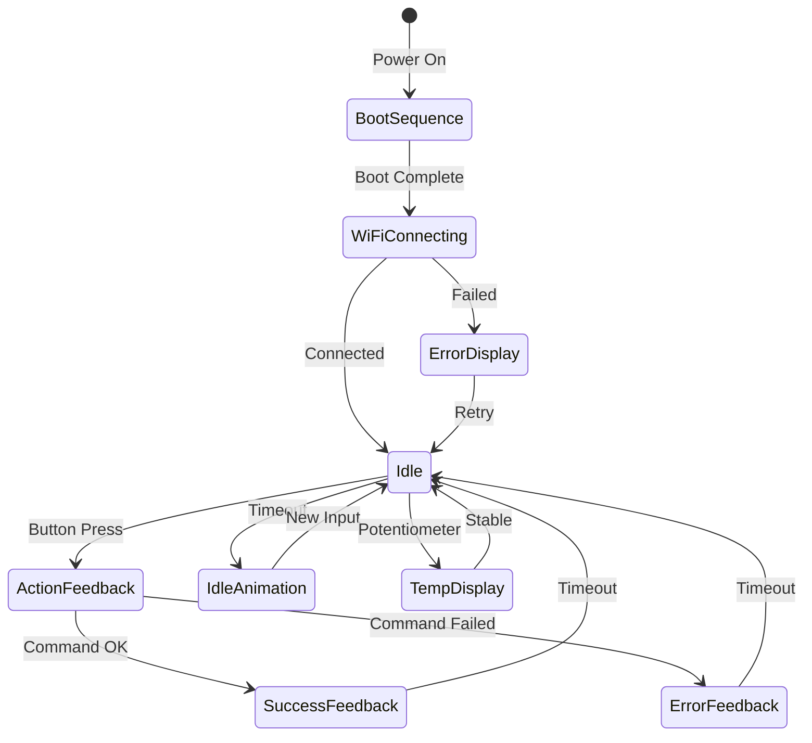

# 8x8 LED Display UX Architecture

## Overview
This document outlines the architecture for a feature-rich, animated user experience on the 8x8 LED matrix display. The design maximizes visual feedback and creates an engaging, informative interface within 64 pixels.

## Current State Analysis

### Existing Capabilities
- **Library**: MD_MAX72xx + MD_Parola (powerful pixel and text control)
- **Display**: Single 8x8 LED matrix (64 pixels total)
- **Current Features**:
  - Numeric display (0-9) with custom 4-wide font
  - PC shutdown progress bar (vertical fill)
  - Display rotation (90° CCW to match physical orientation)
  - 5-second display timeout
  - Direct pixel control via `MD_MAX72XX` object

### Display Coordinate System
```
After rotation (90° CCW):
  Physical view (looking at display):
  
  Col: 0 1 2 3 4 5 6 7
Row 0: □ □ □ □ □ □ □ □  ← Top
    1: □ □ □ □ □ □ □ □
    2: □ □ □ □ □ □ □ □
    3: □ □ □ □ □ □ □ □
    4: □ □ □ □ □ □ □ □
    5: □ □ □ □ □ □ □ □
    6: □ □ □ □ □ □ □ □
    7: □ □ □ □ □ □ □ □  ← Bottom
```

## System Architecture

### 1. Display State Machine



### Display Modes
1. **BOOT_SEQUENCE** - Initial startup animation
2. **WIFI_STATUS** - Connection progress/status
3. **IDLE** - Standby state (ready indicator)
4. **IDLE_ANIMATION** - Screensaver-style animations
5. **ACTION_ICON** - Show action being performed
6. **PROGRESS_BAR** - Progress indicator (shutdown, etc.)
7. **SUCCESS** - Checkmark/smiley confirmation
8. **ERROR** - X mark/sad face for failures
9. **TEMP_DISPLAY** - Temperature setpoint display
10. **STATUS_INFO** - System status indicators

### 2. Icon Library Design

#### 8x8 Pixel Art Icons (Binary Format)

Each icon is 8 bytes (1 byte per row), stored in PROGMEM:

```cpp
// Icon format: 8 bytes, MSB is rightmost pixel
const uint8_t ICON_NAME[8] PROGMEM = {
    0b00000000,  // Row 0 (top)
    0b00000000,  // Row 1
    0b00000000,  // Row 2
    0b00000000,  // Row 3
    0b00000000,  // Row 4
    0b00000000,  // Row 5
    0b00000000,  // Row 6
    0b00000000   // Row 7 (bottom)
};
```

#### Icon Catalog

**Action Icons:**
- `ICON_AC` - Air conditioner symbol
- `ICON_LIGHTS` - Light bulb
- `ICON_POWER` - Power symbol
- `ICON_SHUTDOWN` - Shutdown symbol
- `ICON_IMMERSION` - Water heater/waves
- `ICON_PC` - Computer
- `ICON_PLEX` - Play button

**Feedback Icons:**
- `ICON_CHECK` - Checkmark
- `ICON_X` - X mark (error)
- `ICON_HEART` - Success heart
- `ICON_SMILE` - Happy face
- `ICON_SAD` - Sad face
- `ICON_WAITING` - Hourglass

**Status Icons:**
- `ICON_WIFI_0` - No WiFi
- `ICON_WIFI_1` - Weak signal (1 bar)
- `ICON_WIFI_2` - Medium signal (2 bars)
- `ICON_WIFI_3` - Strong signal (3 bars)
- `ICON_ARROW_UP` - Upload/sending
- `ICON_ARROW_DOWN` - Download/receiving

#### Example Icon Designs

```
AC Icon (8x8):           Light Bulb (8x8):      Checkmark (8x8):
  □ □ ■ ■ ■ ■ □ □          □ □ □ ■ ■ □ □ □        □ □ □ □ □ □ □ ■
  □ ■ □ □ □ □ ■ □          □ □ ■ □ □ ■ □ □        □ □ □ □ □ □ ■ □
  □ ■ □ □ □ □ ■ □          □ □ ■ □ □ ■ □ □        □ □ □ □ □ ■ □ □
  ■ □ ■ □ ■ □ □ ■          □ □ ■ ■ ■ ■ □ □        □ □ □ □ ■ □ □ □
  ■ □ □ ■ □ ■ □ ■          □ □ □ ■ ■ □ □ □        ■ □ □ ■ □ □ □ □
  □ ■ □ □ □ □ ■ □          □ □ □ ■ ■ □ □ □        □ ■ ■ □ □ □ □ □
  □ ■ □ □ □ □ ■ □          □ □ □ □ □ □ □ □        □ □ □ □ □ □ □ □
  □ □ ■ ■ ■ ■ □ □          □ □ □ ■ ■ □ □ □        □ □ □ □ □ □ □ □

WiFi 3 bars (8x8):       Smiley (8x8):          X Mark (8x8):
  □ □ □ □ ■ □ □ □          □ □ ■ ■ ■ ■ □ □        ■ □ □ □ □ □ □ ■
  □ □ □ ■ ■ ■ □ □          □ ■ □ □ □ □ ■ □        □ ■ □ □ □ □ ■ □
  □ □ ■ ■ ■ ■ ■ □          ■ □ ■ □ □ ■ □ ■        □ □ ■ □ □ ■ □ □
  □ ■ ■ □ ■ ■ ■ ■          ■ □ □ □ □ □ □ ■        □ □ □ ■ ■ □ □ □
  ■ ■ ■ □ ■ ■ ■ ■          ■ □ ■ □ □ ■ □ ■        □ □ ■ □ □ ■ □ □
  □ □ □ □ ■ □ □ □          ■ □ □ ■ ■ □ □ ■        □ ■ □ □ □ □ ■ □
  □ □ □ □ □ □ □ □          □ ■ □ □ □ □ ■ □        ■ □ □ □ □ □ □ ■
  ■ ■ ■ ■ ■ ■ ■ ■          □ □ ■ ■ ■ ■ □ □        □ □ □ □ □ □ □ □
```

### 3. Animation Framework

#### Animation Types

**1. Frame-based Animations**
- Pre-defined sequence of frames
- Fixed or variable timing between frames
- Examples: spinner, progress indicators

**2. Procedural Animations**
- Calculated in real-time
- Examples: scrolling, fading, matrix rain

**3. Transition Effects**
- Smooth changes between states
- Examples: fade in/out, slide, wipe

#### Animation Structure

```cpp
struct Animation {
    const uint8_t** frames;     // Pointer to frame array
    uint8_t frameCount;          // Number of frames
    uint16_t frameDelay;         // Milliseconds per frame
    bool loop;                   // Loop animation?
    uint8_t currentFrame;        // Current frame index
    unsigned long lastUpdate;    // Last frame change time
};
```

#### Key Animations

**Boot Sequence** (5 frames, 200ms each):
```
Frame 1: Center dot
Frame 2: Small square (2x2)
Frame 3: Medium square (4x4)
Frame 4: Large square (6x6)
Frame 5: Full border, then fade to logo
```

**Spinner** (8 frames, 100ms each):
```
Rotating line pattern around center
```

**Matrix Rain** (Procedural):
```
Vertical columns of pixels falling
Random start positions and speeds
Trail fade effect
```

**Wave Pattern** (Procedural):
```
Sine wave scrolling horizontally
Vertical displacement based on position
```

**Heartbeat** (4 frames, 150ms each):
```
Small heart -> Large heart -> Small heart -> pause
```

### 4. Boot Sequence Design

```cpp
Boot Animation Flow:
1. All LEDs flash (100ms)
2. Expanding circle from center (4 frames, 150ms)
3. Show logo/brand icon (500ms)
4. WiFi status animation
5. Transition to ready state
```

### 5. Idle Animation System

**Idle Timeout**: 30 seconds after last interaction

**Idle Patterns** (rotate through):
1. **Breathing** - Slow fade in/out of border
2. **Matrix Rain** - Classic matrix effect
3. **Wave** - Sine wave scrolling
4. **Starfield** - Random twinkling pixels
5. **Snake** - Single pixel snake game
6. **Clock Face** - Minimal clock display

**Configuration**:
```cpp
#define IDLE_TIMEOUT 30000        // 30 seconds
#define IDLE_ANIMATION_DURATION 10000  // 10s per pattern
```

### 6. Visual Feedback System

#### Action Feedback Flow

```
Button Press → Show Action Icon (500ms)
              ↓
        Send Command → Show Spinner (while waiting)
              ↓
      Success/Failure
          /        \
    SUCCESS        ERROR
    Show ✓         Show X
    (1000ms)      (1500ms)
        \          /
         Fade to Idle
```

#### Feedback Icons by Outcome

**Success:**
- Checkmark (primary)
- Smiley face (alternative)
- Heart (for favorite actions)

**Error:**
- X mark (primary)
- Sad face (alternative)
- Warning symbol (for non-critical)

**In Progress:**
- Spinner (rotating)
- Hourglass
- Progress bar (for timed actions)

### 7. Enhanced Progress Bar System

#### Use Cases
- PC Shutdown (3 second hold) - EXISTING
- WiFi Connection attempts
- Command timeout warnings
- Long-running automations

#### Progress Bar Styles

**Vertical Fill** (current):
```
Fills from bottom to top
Used for: Time-based holds
```

**Horizontal Fill**:
```
Fills from left to right
Used for: Connection progress
```

**Border Progress**:
```
Draws around perimeter clockwise
Used for: General loading
```

**Segmented**:
```
8 segments filling sequentially
Used for: Multi-step processes
```

### 8. Status Indicator System

#### WiFi Status Indicator
```cpp
Display position: Top-right corner (3 pixels)
States:
- Disconnected: Blank
- Connecting: Blinking
- Weak (1 bar): □ □ ■
- Medium (2 bars): □ ■ ■
- Strong (3 bars): ■ ■ ■
```

#### HA Connection Status
```cpp
Display position: Top-left corner (1 pixel)
States:
- Connected: Solid
- Disconnected: Blinking
- Error: Fast blink
```

#### Combined Status Bar (Top Row)
```
[HA] □ □ □ □ □ [WiFi]
 1 pixel  5 center  3 pixels
```

### 9. Interactive Confirmation System

#### Button Press Feedback
```
Press Detected:
1. Quick flash (50ms) - instant tactile feedback
2. Show action icon (300ms)
3. Fade icon intensity
4. Show spinner while processing
5. Result feedback (success/error)
```

#### Hold-to-Confirm Actions
```
PC Shutdown (existing):
- Vertical progress bar fills over 3 seconds
- Release early = cancel (flash X)
- Complete hold = execute (flash ✓ then shutdown)

Extensible for other critical actions:
- Factory reset
- Long automation sequences
```

### 10. Smooth Transitions

#### Transition Effects

**Fade**:
```cpp
- Gradually decrease/increase LED intensity
- Uses PWM-like timing (not true brightness control)
- Implementation: Frame-by-frame density reduction
```

**Slide**:
```cpp
- Content scrolls off screen
- New content scrolls in from opposite side
- Directions: up, down, left, right
```

**Wipe**:
```cpp
- Progressive reveal/hide
- Column-by-column or row-by-row
- Directions: left-to-right, top-to-bottom
```

**Expand/Collapse**:
```cpp
- Center point expands outward
- Or edge collapses inward
- Radial or square pattern
```

## Implementation Structure

### File Organization

```
src/
├── main.cpp                 # Main program (existing)
├── display/
│   ├── display_manager.h    # Display state machine
│   ├── display_manager.cpp
│   ├── icons.h              # Icon definitions
│   ├── animations.h         # Animation framework
│   ├── animations.cpp
│   ├── effects.h            # Transition effects
│   └── effects.cpp
```

### Memory Optimization

**Icon Storage**:
```cpp
// Store in PROGMEM to save RAM
const uint8_t icons[][8] PROGMEM = { ... };

// Access with pgm_read_byte()
uint8_t row = pgm_read_byte(&icons[iconIndex][rowIndex]);
```

**Animation Frames**:
```cpp
// Pre-compute frames, store in flash
// Load one frame at a time into RAM
// Reduces RAM usage from ~512 bytes to ~8 bytes per active animation
```

### Display Manager Class

```cpp
class DisplayManager {
private:
    MD_MAX72XX* mx;
    DisplayMode currentMode;
    Animation* currentAnimation;
    unsigned long modeStartTime;
    unsigned long idleTimeout;
    
public:
    void init(MD_MAX72XX* matrix);
    void update();                    // Call every loop
    void showIcon(uint8_t iconIndex, uint16_t duration);
    void showAnimation(Animation* anim);
    void showProgress(uint8_t percent, ProgressStyle style);
    void transitionTo(DisplayMode newMode, TransitionEffect effect);
    void setIdleAnimation(uint8_t animIndex);
};
```

## Timing and Performance

### Update Frequency
```cpp
Display update: 10-20ms (50-100 FPS)
Animation frames: 50-200ms typically
State transitions: Immediate with effect overlay
```

### Memory Budget
```cpp
Icon library: ~40 icons × 8 bytes = 320 bytes (PROGMEM)
Animation frames: ~10 animations × 8 frames × 8 bytes = 640 bytes (PROGMEM)
Runtime state: ~100 bytes (RAM)
Total: ~1KB flash, ~100 bytes RAM
```

## Configuration Options

### User-Configurable Settings (config.h)

```cpp
// Display Behavior
#define DISPLAY_IDLE_TIMEOUT 30000        // MS until screensaver
#define DISPLAY_ACTION_DURATION 1000      // MS to show action icon
#define DISPLAY_SUCCESS_DURATION 1000     // MS to show success
#define DISPLAY_ERROR_DURATION 1500       // MS to show error

// Animation Settings  
#define ENABLE_IDLE_ANIMATIONS true       // Screensaver animations
#define IDLE_ANIMATION_TYPE MATRIX_RAIN   // Default idle animation
#define ANIMATION_SPEED 100               // MS per frame (lower = faster)

// Visual Preferences
#define SHOW_STATUS_BAR true              // WiFi/HA status indicators
#define USE_SMOOTH_TRANSITIONS true       // Animated transitions
#define BOOT_ANIMATION_STYLE EXPAND       // Boot sequence type
```

## Example Usage Scenarios

### Scenario 1: Button Press (AC Power)
```
User presses AC button
→ Quick flash (instant feedback)
→ Show AC icon (300ms)
→ Show spinner while sending command
→ Receive success from HA
→ Show checkmark (1000ms)
→ Fade to idle mode
→ After 30s: Start matrix rain animation
```

### Scenario 2: Temperature Change
```
User turns potentiometer
→ Show temperature number immediately
→ User adjusts, number updates live
→ User stops at 24°C
→ After 500ms stable: Send to HA
→ Show ✓ briefly
→ Return to temperature display
→ After 5s: Fade to idle
```

### Scenario 3: WiFi Reconnection
```
WiFi disconnects
→ Status indicator blinks
→ After 30s: Show "connecting" animation
→ Horizontal progress bar (attempt progress)
→ Connection successful
→ Show WiFi icon with 3 bars
→ Return to previous mode
```

### Scenario 4: Boot Sequence
```
Power on
→ All LEDs pulse (heartbeat)
→ Expanding circle from center
→ Show project logo/icon
→ WiFi connecting animation
→ WiFi success (bars appear)
→ Show "ready" smiley
→ Fade to idle mode
```

## Testing Strategy

1. **Icon Rendering**: Test each icon displays correctly
2. **Animation Smoothness**: Verify frame rates are comfortable
3. **State Transitions**: Test all mode changes work properly  
4. **Memory Usage**: Monitor RAM/Flash usage stays within limits
5. **Timing Accuracy**: Verify timeouts and durations are correct
6. **User Feedback**: Test responsiveness feels immediate

## Future Enhancements

- **Custom Icon Designer**: Web tool to create 8x8 icons
- **Animation Editor**: Visual animation sequence builder
- **Remote Control**: Change idle animations via HA
- **Notifications**: Show HA notifications on display
- **Mini Games**: Simple games during idle time
- **Weather Icons**: Show current weather conditions
- **Clock Mode**: Display time in creative ways

## Conclusion

This architecture provides a comprehensive, scalable foundation for creating an engaging, informative LED display UX. The modular design allows features to be implemented incrementally while maintaining code organization and performance.