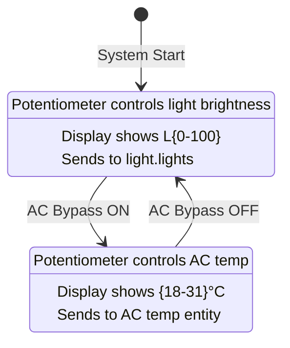

# Light Control & Potentiometer Refactor Plan

## Overview
This plan details the implementation for adding light scene control via Extra Button 1 and modifying the potentiometer behavior to control light brightness by default, switching to AC temperature control only when AC bypass is active.

## Current State Analysis

### Potentiometer Current Behavior
- **Location**: [`src/io/sensor_manager.cpp`](src/io/sensor_manager.cpp)
- **Current Mode**: Single-purpose AC temperature control
- **ADC Reading**: GPIO 34 (12-bit ADC, 0-4095)
- **Temperature Range**: 18°C - 31°C (configured in [`include/config.h`](include/config.h))
- **Debouncing**: 10 samples averaging, 500ms stability duration
- **Output**: Sends temperature to `number.air_conditioner_temp_set`

### Extra Button 1 Current Configuration
- **Location**: [`src/main.cpp`](src/main.cpp:102), [`src/io/input_manager.cpp`](src/io/input_manager.cpp:37)
- **Pin**: GPIO 17 (BTN_EXTRA_1_PIN)
- **Type**: Momentary button
- **Current Entity**: `switch.extra_1` (generic toggle)
- **Current Service**: `toggle`

### AC Bypass State Tracking
- **Location**: [`src/io/input_manager.cpp`](src/io/input_manager.cpp:33)
- **Pin**: GPIO 13 (BTN_AC_BYPASS_PIN)
- **Type**: Toggle switch
- **Entity**: `input_boolean.ac_bypass`
- **Current Handling**: Special case in [`control_panel.cpp`](src/control_panel.cpp:282-289)

## Required Changes

### 1. Configuration Updates ([`include/config.h`](include/config.h))

**Add new entity definitions:**
```cpp
// Light control
#define ENTITY_LIGHT_SCENE "scene.lights_evening"
#define ENTITY_LIGHTS_BRIGHTNESS "light.lights"

// Brightness settings
#define BRIGHTNESS_MIN 0    // Minimum brightness percentage
#define BRIGHTNESS_MAX 100  // Maximum brightness percentage
```

**Update Extra 1 entity:**
```cpp
// Change from:
#define ENTITY_EXTRA_1 "switch.extra_1"
// To:
#define ENTITY_EXTRA_1 "scene.lights_evening"
```

### 2. Sensor Manager Enhancements ([`src/io/sensor_manager.h`](src/io/sensor_manager.h))

**Add mode tracking:**
```cpp
enum PotentiometerMode {
    POT_MODE_BRIGHTNESS,    // Default: control light brightness
    POT_MODE_TEMPERATURE    // AC bypass active: control AC temperature
};

class SensorManager {
private:
    PotentiometerMode _currentMode;
    bool _acBypassActive;
    int _currentBrightness;     // Current brightness percentage (0-100)
    int _lastSentBrightness;    // Last brightness sent to HA
    bool _brightnessChanged;    // Flag for brightness changes
    
public:
    void setACBypassState(bool active);
    bool isBrightnessMode() const;
    int getBrightnessPercentage() const;
    bool hasBrightnessChanged();
};
```

**Method signatures to add:**
```cpp
// Set AC bypass state (called when bypass switch changes)
void setACBypassState(bool active);

// Check current potentiometer mode
bool isBrightnessMode() const { return _currentMode == POT_MODE_BRIGHTNESS; }

// Get current brightness percentage (0-100)
int getBrightnessPercentage() const;

// Check if brightness has changed (clears flag after read)
bool hasBrightnessChanged();
```

### 3. Sensor Manager Implementation ([`src/io/sensor_manager.cpp`](src/io/sensor_manager.cpp))

**Constructor updates:**
```cpp
SensorManager::SensorManager(IConfigManager* config, ILogger* logger)
    : _config(config), _logger(logger), _potPin(0), 
      _currentSetpoint(20), _lastSentSetpoint(-1), _temperatureChanged(false),
      _currentBrightness(50), _lastSentBrightness(-1), _brightnessChanged(false),
      _currentMode(POT_MODE_BRIGHTNESS), _acBypassActive(false),  // NEW
      _potReadIndex(0), _potTotal(0), _stableValue(-1), _stableTime(0) {
}
```

**Add mode switching method:**
```cpp
void SensorManager::setACBypassState(bool active) {
    if (_acBypassActive != active) {
        _acBypassActive = active;
        PotentiometerMode newMode = active ? POT_MODE_TEMPERATURE : POT_MODE_BRIGHTNESS;
        
        if (newMode != _currentMode) {
            _logger->logf("INFO", "Sensor Manager: Switching potentiometer mode to %s",
                         newMode == POT_MODE_BRIGHTNESS ? "BRIGHTNESS" : "TEMPERATURE");
            _currentMode = newMode;
            
            // Reset stability tracking when switching modes
            _stableValue = -1;
            _stableTime = millis();
        }
    }
}
```

**Add brightness calculation method:**
```cpp
int SensorManager::adcToBrightness(int adcValue) const {
    // Map ADC range to brightness percentage (0-100)
    return map(adcValue, 0, _config->getADCMaxValue(), 
               BRIGHTNESS_MIN, BRIGHTNESS_MAX);
}
```

**Modify update() method:**
```cpp
void SensorManager::update() {
    // Read new value and add to rolling average
    int newReading = analogRead(_potPin);
    _potTotal -= _potReadings[_potReadIndex];
    _potReadings[_potReadIndex] = newReading;
    _potTotal += _potReadings[_potReadIndex];
    _potReadIndex = (_potReadIndex + 1) % POT_SAMPLES;

    int averagedADC = _potTotal / POT_SAMPLES;
    
    if (_currentMode == POT_MODE_BRIGHTNESS) {
        // Brightness mode (default)
        updateBrightnessMode(averagedADC);
    } else {
        // Temperature mode (AC bypass active)
        updateTemperatureMode(averagedADC);
    }
}

void SensorManager::updateBrightnessMode(int averagedADC) {
    int brightnessValue = adcToBrightness(averagedADC);
    
    // Update current brightness immediately for responsive feel
    _currentBrightness = brightnessValue;
    
    // Check stability for change detection
    if (isValueStable(brightnessValue)) {
        if (brightnessValue != _lastSentBrightness) {
            _brightnessChanged = true;
            _lastSentBrightness = brightnessValue;
            _logger->logf("INFO", "Sensor Manager: Brightness STABLE at %d%% - triggering change", brightnessValue);
        }
    } else {
        updateStability(brightnessValue);
    }
}

void SensorManager::updateTemperatureMode(int averagedADC) {
    // Existing temperature update logic
    int temperatureValue = adcToTemperature(averagedADC);
    _currentSetpoint = temperatureValue;
    
    if (isValueStable(temperatureValue)) {
        if (temperatureValue != _lastSentSetpoint) {
            _temperatureChanged = true;
            _lastSentSetpoint = temperatureValue;
            _logger->logf("INFO", "Sensor Manager: Temperature STABLE at %d°C - triggering change", temperatureValue);
        }
    } else {
        updateStability(temperatureValue);
    }
}
```

### 4. Control Panel Updates ([`src/control_panel.cpp`](src/control_panel.cpp))

**Modify handleToggleSwitch() to track AC bypass:**
```cpp
void ControlPanel::handleToggleSwitch(uint8_t switchIndex) {
    const void* voidState = _inputManager->getButtonState(switchIndex);
    const InputManager::ButtonState* buttonState = static_cast<const InputManager::ButtonState*>(voidState);
    if (!buttonState) return;

    bool isOn = _inputManager->getSwitchState(switchIndex);
    const char* service = isOn ? "turn_on" : "turn_off";

    _logger->logf("INFO", "Control Panel: Switch %s changed to %s",
                  _inputManager->getButtonName(switchIndex), isOn ? "ON" : "OFF");

    // Special handling for AC Bypass switch
    if (strcmp(buttonState->entityId, _config->getEntityId("ac_bypass")) == 0) {
        // Notify sensor manager of bypass state change
        _sensorManager->setACBypassState(isOn);  // NEW
        
        if (isOn) {
            sendHACommand(_config->getEntityId("ac_bypass"), "turn_on");
        } else {
            sendHACommand(_config->getEntityId("ac_automation"), "trigger");
        }
    } else {
        // Normal toggle switch
        sendHACommand(buttonState->entityId, service);
    }

    // Visual feedback
    #if ENABLE_BUTTON_FLASH
        _displayManager->flash(50);
    #endif
    _displayManager->showActionIcon(_inputManager->getButtonName(switchIndex));
}
```

**Modify processSensors() to handle both modes:**
```cpp
void ControlPanel::processSensors() {
    if (_sensorManager->isBrightnessMode()) {
        // Brightness control mode
        static int lastDisplayedBrightness = -999;
        int currentBrightness = _sensorManager->getBrightnessPercentage();
        
        if (currentBrightness != lastDisplayedBrightness) {
            _displayManager->showBrightness(currentBrightness);  // NEW method
            lastDisplayedBrightness = currentBrightness;
            _logger->logf("DEBUG", "Control Panel: Displaying live brightness: %d%%", currentBrightness);
        }
        
        if (_sensorManager->hasBrightnessChanged()) {
            handleBrightnessChange();
        }
    } else {
        // Temperature control mode (existing logic)
        static int lastDisplayedTemp = -999;
        int currentTemp = _sensorManager->getTemperatureSetpoint();
        
        if (currentTemp != lastDisplayedTemp) {
            _displayManager->showTemperature(currentTemp);
            lastDisplayedTemp = currentTemp;
            _logger->logf("DEBUG", "Control Panel: Displaying live temp: %d°C", currentTemp);
        }
        
        if (_sensorManager->hasTemperatureChanged()) {
            handleTemperatureChange();
        }
    }
}
```

**Add new handleBrightnessChange() method:**
```cpp
void ControlPanel::handleBrightnessChange() {
    int brightness = _sensorManager->getBrightnessPercentage();
    
    _logger->logf("INFO", "Control Panel: Sending stable brightness %d%% to Home Assistant", brightness);
    
    // Send brightness command to HA
    StaticJsonDocument<128> data;
    data["brightness_pct"] = brightness;
    
    sendHACommand(_config->getEntityId("lights_brightness"), "turn_on", &data);
}
```

### 5. Input Manager Updates ([`src/io/input_manager.cpp`](src/io/input_manager.cpp))

**Update Extra Button 1 configuration in begin():**
```cpp
// Change from:
configureInput(5, _config->getPin("button_5"), _config->getEntityId("extra_1"), "toggle", MOMENTARY_BUTTON);

// To:
configureInput(5, _config->getPin("button_5"), _config->getEntityId("extra_1"), "turn_on", MOMENTARY_BUTTON);
```

Note: For scene entities, Home Assistant uses `turn_on` service instead of `toggle` or `trigger`.

### 6. Display Manager Updates ([`src/display/display_manager.h`](src/display/display_manager.h))

**Add brightness display method:**
```cpp
/**
 * @brief Show brightness percentage value
 * @param brightness Brightness percentage (0-100)
 */
void showBrightness(int brightness);
```

**Implementation in [`display_manager.cpp`](src/display/display_manager.cpp):**
```cpp
void DisplayManager::showBrightness(int brightness) {
    char msg[8];
    snprintf(msg, sizeof(msg), "L%d", brightness);  // L for Light brightness
    
    _parola->displayClear();
    _parola->displayText(msg, PA_CENTER, 0, 0, PA_PRINT, PA_NO_EFFECT);
    
    extendIdleTimer();
}
```

### 7. Config Manager Updates ([`src/core/config_manager.cpp`](src/core/config_manager.cpp))

**Add getter methods for new entities:**
```cpp
const char* ConfigManager::getEntityId(const char* name) const {
    // ... existing cases ...
    if (strcmp(name, "light_scene") == 0) return ENTITY_LIGHT_SCENE;
    if (strcmp(name, "lights_brightness") == 0) return ENTITY_LIGHTS_BRIGHTNESS;
    // ... rest of cases ...
}
```

## Implementation Flow Diagram

```mermaid
graph TD
    A[AC Bypass Switch Changed] --> B{Bypass ON?}
    B -->|Yes| C[Sensor Manager: Switch to TEMP mode]
    B -->|No| D[Sensor Manager: Switch to BRIGHTNESS mode]
    
    C --> E[Potentiometer reads ADC]
    D --> E
    
    E --> F{Current Mode?}
    F -->|BRIGHTNESS| G[Calculate brightness 0-100%]
    F -->|TEMP| H[Calculate temp 18-31°C]
    
    G --> I[Display: Show L{value}]
    H --> J[Display: Show temperature]
    
    I --> K{Value stable?}
    J --> K
    
    K -->|Yes| L{Mode?}
    L -->|BRIGHTNESS| M[Send light.lights brightness_pct]
    L -->|TEMP| N[Send AC temp setpoint]
    
    O[Extra Button 1 Pressed] --> P[Send scene.lights_evening turn_on]
    P --> Q[Display: Show action icon]
```

## State Tracking Flow



## Testing Strategy

### Unit Testing
1. **Sensor Manager Mode Switching**
   - Verify default mode is BRIGHTNESS
   - Test setACBypassState() switches modes correctly
   - Verify stability tracking resets on mode change

2. **ADC to Brightness Conversion**
   - Test ADC 0 → 0% brightness
   - Test ADC 4095 → 100% brightness
   - Test mid-range values map correctly

3. **Change Detection**
   - Verify brightness changes trigger events
   - Verify temperature changes still work in temp mode
   - Test that mode switching doesn't trigger false changes

### Integration Testing
1. **AC Bypass Workflow**
   - Start in brightness mode
   - Toggle AC bypass ON → verify temp mode active
   - Adjust potentiometer → verify AC temp changes
   - Toggle AC bypass OFF → verify brightness mode active
   - Adjust potentiometer → verify brightness changes

2. **Extra Button 1 Scene Change**
   - Press button → verify scene.lights_evening activated
   - Check display feedback shows correct action
   - Verify no interference with other buttons

3. **Display Updates**
   - Brightness mode shows "L##" format
   - Temperature mode shows "##" format (existing)
   - Mode switch updates display correctly

### Edge Cases
1. Rapid AC bypass toggling
2. Potentiometer adjustment during mode switch
3. Multiple button presses during potentiometer changes
4. System restart with AC bypass already ON

## Files to Modify

| File | Changes | Complexity |
|------|---------|------------|
| [`include/config.h`](include/config.h) | Add entity IDs, brightness range constants | Low |
| [`src/io/sensor_manager.h`](src/io/sensor_manager.h) | Add mode enum, state variables, new methods | Medium |
| [`src/io/sensor_manager.cpp`](src/io/sensor_manager.cpp) | Implement dual-mode logic, brightness calculations | High |
| [`src/control_panel.h`](src/control_panel.h) | Add handleBrightnessChange() declaration | Low |
| [`src/control_panel.cpp`](src/control_panel.cpp) | Update processSensors(), handleToggleSwitch(), add handleBrightnessChange() | High |
| [`src/io/input_manager.cpp`](src/io/input_manager.cpp) | Change Extra Button 1 service to turn_on | Low |
| [`src/display/display_manager.h`](src/display/display_manager.h) | Add showBrightness() declaration | Low |
| [`src/display/display_manager.cpp`](src/display/display_manager.cpp) | Implement showBrightness() method | Low |
| [`src/core/config_manager.cpp`](src/core/config_manager.cpp) | Add entity ID mappings | Low |
| [`include/interfaces.h`](include/interfaces.h) | Update ISensorManager interface | Medium |

## Risks and Mitigations

### Risk 1: Mode Confusion
**Issue**: User forgets which mode potentiometer is in
**Mitigation**: Display prefix differentiates modes (L## vs plain ##)

### Risk 2: Brightness Flicker
**Issue**: Rapid HA commands during brightness adjustment
**Mitigation**: Existing stability duration (500ms) prevents this

### Risk 3: AC Bypass State Desync
**Issue**: System restarts with AC bypass in unknown state
**Mitigation**: Default to brightness mode on startup, rely on switch state reading

### Risk 4: Scene Not Activating
**Issue**: Incorrect service call for scene entity
**Mitigation**: Use `turn_on` service which is standard for scenes

## Configuration Notes

After implementation, users need to update their Home Assistant configuration with:
- Scene entity: `scene.lights_evening`
- Light entity for brightness: `light.lights`

The user may need to adjust these entity IDs in [`config.h`](include/config.h) to match their specific HA setup.

## Performance Considerations

- Mode switching happens only on AC bypass toggle events (low frequency)
- Brightness calculations use same ADC averaging as temperature (no additional overhead)
- Display updates occur at same rate regardless of mode
- No additional memory overhead beyond a few state variables

## Future Enhancements (Not in Scope)

- Multiple scene selection via button hold or multiple presses
- Brightness presets via quick double-tap
- Smooth brightness transitions
- Save last brightness/temp values between reboots
- Display current mode indicator in idle state
